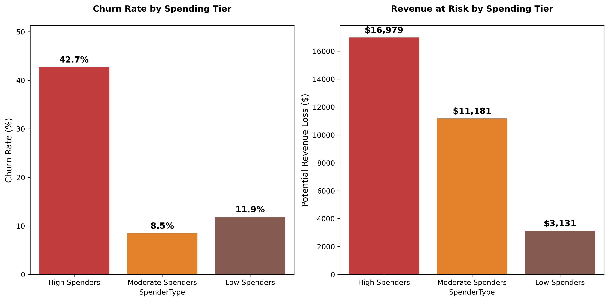

# SyriaTel-Churn-Analysis

## Business Understanding
Customer churn (also called attrition) refers to the number of subscribers who discontinue services within a specific period.
In telecom – where competition is intense and switching costs are minimal – reducing attrition is critical for maintaining profitability, as acquiring new customers costs 5-7x more than retaining existing ones.

SyriaTel, as a leading telecommunications provider in Syria, faces significant challenges in customer retention due to industry competition. Historically, 14.5% of its' customers have been churning eroding 15.9% of its' revenue monthly. According to management, customer attrition has become a wound that needs immediate medical attention. Therefore, it has approached us to diagnose its' data to determine causes leading to customer churn and create a model to proactively predict at risk customers for retention plans.

The objective of this project is to create a model that will reduce customer churn by 70%. To achieve this, we need to unleash sophisticated machine learning algorithms that will proactively identify at-risk subscribers using behavioral patterns and spending tiers, enabling targeted retention strategies to curb attrition.   

### Stakeholder

- The key stakeholders for this project include:  
   - SyriaTel Management : To strategize & Implement Customer retention programs
   - Marketing Team: Interested in identifying at-risk customers for targeted retention campaigns.
   - Customer Service Team: They need to understand how support quality and call volume relate to churn so that they can help.
   - Finance Team: Monitors revenue impact from Customer loss and use this insights to forecast revenue and allocate budgets to retention.

### Objectives

- This project aims to:

   - Classify customers as likely to churn ("True") or stay ("False").
   - Identify factors that contribute most to customer churn.
   - Enable actionable data driven insights to guide SyriaTel’s marketing, sales, and support teams in preventing churn.

## Data Understanding

### Data source

The dataset used for this project is from Kaggle: [Churn in Telecoms Dataset](https://www.kaggle.com/datasets/becksddf/churn-in-telecoms-dataset)

### Variabe Description

- The dataset provided contains customer-level usage and service information from SyriaTel, aimed at identifying patterns that lead to customer churn. 
- The dataset has 3333 rows which represents unique customers and 21 column which captures features that influence their decision to continue with the services or leave(Churn).
- There are 19 features (predictor variables), 1 unique customer identifier(phone number) and 1 target variable (churn). Below is a breakdown of each variable:
   1. state - This shows the state where the customer resides and it can be help identify geographic patterns in churn.
   2. area code - Associated with the customers Phone number.
   3. phone number - Customer's phone number (serves as an Unique identifier)
   4. account length- Duration of customer’s relationship with SyriaTel. 
   5. international plan- Indicates whether the customer has an international calling plan (`yes`/`no`)
   6. voice mail plan - Indicates whether the customer has subscribed to voice mail service plan (`yes`/`no`)
   7. total day calls - Total number of calls made during the day
   8. total day minutes - Total number of minutes the customer has spent on calls during the day
   9. total eve minutes - Total minutes of calls made in the evening
   10. total eve calls - Total number of evening calls
   11. total night minutes- The total number of minutes the customer has spent on calls during the night.
   12. total night calls - The total number of calls the customer has made during the night
   13. total intl minutes -  The total number of minutes the customer has spent on international calls.
   14. total intl calls  -  The total number of international calls the customer has made.
   15. number vmail messages - Number of voice mail messages the customer has received.
   16. total night charge - The total charges incurred by the customer for nighttime calls.
   17. total intl charge - The total charges incurred by the customer for international calls.
   18. total eve charge - Total charges Incurred by the customer for evening call
   19. total day charge - Total charge incurred by the customer for daytime calls
   20. customer service calls - The number of times the customer has called customer service.
   21. churn -  Whether the customer has churned (`True` = churned, `False` = active)

 ### Data Limitation:
- Class Imbalance: about 85.5% of the customers did not churn, while only 14.5% did. This imbalance can affect model performance by making it biased toward predicting the majority class.

### Data Preparation:
- This involves preparing the dataset for analysis and modeling. I carried out the following:

   - Reviewed the structure of the dataset and summarized key statistics
   - Checked for missing values and duplicates
   - I did proper column names(snake casing)  
   - Created some columns('revenue' to sum up charges and 'spender type' to classify customers on amount charged)
   - Removed irrelevant columns('phone number' and 'charges) that don't contribute to analysis
   - Encoding Categorical Features
   - Data Standardization

 ####  Feature types
 - Categorical Variable:
   - state
   - area code
   - international plan
   - voicemail plan
   - churn

- Numerical Variable: 
   - account length
   - number vmail messages
   - total day minutes
   - total day calls
   - total day charge
   - total eve minutes
   - total eve calls
   - total eve charge
   - total night minutes
   - total night calls
   - total night charge
   - total intl minutes
   - total intl charge
   - customer service calls  

 ## Exploratory Data Analysis (EDA) 
- Churn Rate
- Distributions of Numeric & Categorical features
- Factors that contribute most to customer churn.
- Peason correlation analysis

### Churn Distribution
- From the class distribution, we observe that 14.5% churned while 85.5% of the customers stayed. This implies that the class is imbalanced. 

### Factors that contribute most to customer churn.
- To better understand what drives customers to leave, I grouped the variables into thematic areas and explored their impact on churn. These factors include:
   - Created Revenue column (totaling of all charges ) - to evaluate if higher billing is associated with customer dissatisfaction and churn.
   - Spender type ( categorized customers according to charges spent) - to determine whether the   organization is breeding high value customers
   - Service Plan Subscriptions (International Plan & Voice Mail Plan) — Does having specific plans influences churn likelihood
   - Usage Behavior (Call & Minute Usage during all period of time) — Does time(day, evening or night) usage correlates to churn.
   - Geographical Factors(State) - to detect regional or location-based trends in churn.
   - Customer Service Interaction (Number of Customer Service Calls) — Does frequent service contact signals dissatisfaction.

#### Geographical Analysis

- To support the company’s location based retention strategy, I identified which states have the highest number of churned customers.
- I visualized the churn intensity to helps the company to prioritize outreach efforts and marketing campaigns in high-churn states and design targeted interventions by region.
   - Washington, New jersey & Texas have the highest customers who have churned
   - Majority of other states reflect a moderate level of churn and shouldn't be overlooked when designing region-specific retention strategies

#### Spender type
- To understand how customer are spend, I have classified the as follows:
   - Revenue more or equal to $70 as high-spenders
   - Revenue less tha $70 and equals or more than $50 as moderate spenders
   - Revenue less than $50 as low spenders

- *Is the organization breeding high value customers?*
   - The high spenders churn the most(42.7%).
   - Moderate spender churn at 8.5%.
   - Low spender churn at 11.9%
   - It's evident the organization is breeding high value customers.

#### Financial impact
- I compared the total revenue from churned vs. non-churned customers, and shows what percentage of overall revenue each group contributes.
- Churned customers account for 15.9% of the company’s total revenue loss. On average, each customer who leaves contributes approximately 1.4% to that lost revenue.

#### Service Plan Analysis
- To understand the impact of service subscriptions on churn, I examined whether having an international plan or a voice mail plan made customers more or less likely to churn.
   - Customers with an international plan are significantly more likely to churn compared to those without.
   - Customers with a voice mail plan are less likely to churn.
   - The highest risk group is international plan customers with no voicemail Services and the company should have immediate action  for these group of customers

#### Customer Service Calls
- To assess whether customer dissatisfaction drives churn, I examined the number of customer service calls made, as repeated contact without support may indicate unresolved issues or frustration.
   - Customers who churned made an average of 2.23 calls.
   - Customers who stayed made an average of 1.45 calls.

- The difference of just one extra call on average suggests a thin line between staying and churning, even a small increase in service issues can tip a customer toward leaving.

- The churn rate increases sharply with the number of service calls therefore the company should work on the first contact resolution
      - Churn decreases with lower support calls, especially for long-tenure customers
      - Once customers hit 5 or more service calls, churn shoots up (above 50%+) indicating rising dissatisfaction

#### Different Time Period usage Analysis.
- To understand whether customer activity levels influence churn, I analyzed usage patterns across different time periods and services to see if low or high engagement is linked to a higher likelihood of churn.
   - Churned customers generally use more call minutes, particularly during the day, than those who remain. This could suggest that higher usage may lead to greater sensitivity to costs, influencing their decision to leave.
   - The number of calls (day, evening, night, international) remains nearly the same between both groups.

### Strategies to Reduce Churn
- Observation:
   - Churn rates vary significantly across states, with certain regions (e.g., Washington, Texas) showing notably higher churn levels.
   - High spender churn 4 times the moderate spenders. They contribute to 54% of the lost revenue to churn.
   - Customers subscribed to the international plan are approximately 4 times more likely to churn, suggesting potential dissatisfaction with pricing or perceived value. In contrast, those with the voice mail plan are more likely to stay, indicating its possible role in enhancing user satisfaction.
   - Although differences in call usage are subtle, churned customers tend to use more day and international minutes, which may signal either heavy reliance or cost-related concerns.
   - Churned users incur higher average charges, especially during daytime and international calls, reinforcing the idea that high-spending customers may feel less value for money.
   - There is a strong positive relationship between customer service interactions and churn. Customers who make 4 or more calls to support are at particularly high risk, possibly due to unresolved complaints or poor service experiences.

- Recommendation:
   - Run localized campaigns in high-churn states (Washington, Texas) with deeper investigation into region specific issues like service quality, network coverage or billing concerns.
   - Develop onboarding programs for new customers and loyalty program for long term customers to reduce early drop-offs and late disengagement.
   - Proactively monitor customers with 3+ support calls and prioritize them for resolution.Implement callback system for complex issues
   - Reassess the value proposition of the international plan. This could involve improving call quality, reducing costs, or bundling with other perks to increase satisfaction.
   -  Consider making the voice mail plan a default offering or promote it more actively, given its positive association with retention.
   - Introduce spending caps or usage notifications for customers who pay more especially during daytime & International calls to help manage expectations and reduce bill shock as these users are more likely to churn.

## Modeling

- Objective
    - The goal is to predict customer churn for SyriaTel using available customer data. This helps the company proactively retain customers likely to stop using the service.

### Data Preparation
- I encoded categorical variables (international plan, voice mail plan, churn,state).
- I standardized features using StandardScaler.
- To address the imbalanced (churn rate ~14%) datasets i have applied SMOTE (Synthetic Minority Oversampling Technique) on the training data to create a balanced training set.
- Hyperparameter tuning:
   - estimators (number of trees)
   - max_depth(depth of each tree) to control split
   - coefficients for regularization 
   - CV(cross validation) 
   - class weight - trained on balanced class

### Models used
- Basic logistic regression: Used as a baseline model. Can not capture well at risk customers
    - Churn Recall: 33% missing 67% churners
    - Churn Precision: 73% meaning 27% false alarms
    - ROC AUC: 86%
    - Accuracy: 88%
    - Low recall for churners (33%) but high precision (73%), missing 67% churners.
- Regularized logistic regression: Performed poor with more than 50% false alarms.
    - Churn Recall: 80% missing 20% churners
    - Churn Precision: 42% indicating 58% false alarms
    - ROC AUC: 86%
    - Accuracy: 81%
- SMOTE - Regularized logistic regression: Precision will mislead to invest on false alerts.
    - Churn Recall: 81% missing 19% churners
    - Churn Precision: 45% indicating 55% false alarms
    - ROC AUC: 87%
    - Accuracy: 82%
- Basic Random Forest Classifier: Missed 43% at risk customers - poor performance 
    - Churn Recall: 57% missing 43% churners
    - Churn Precision: 97% indicating 3% false alarms
    - ROC AUC: 94%
    - Accuracy: 93%
- Advanced Random Forest Classifier: Out performed all other models. Balanced between recall and precision as well as good ROC AUC.
    - Churn Recall: 77% missing 23% churners
    - Churn Precision: 81% indicating 19% false alarms
    - ROC AUC: 93%
    - Accuracy: 93%
    - Accuracy: 94%
    - Confusion Matrix:
         - 548 True Negatives
         - 78 True Positives
         - 18 False Positives (Type I errors)
         - 23 False Negatives (Type II errors)

## Strategic Recommendations
### 1. Immediate Priority: Protect High-Value Revenue (0–30 Days)
- **A. Target High-Spenders ($70+/Month) – 54% of Lost Revenue**
- ***Action:** Assign dedicated account managers to high-spenders for proactive support.
- **Justification:** Losing just 50 high-spenders costs a minimum of $3,500/month ($70/churner).
- **Retention Offer:** Personalized discounts (≤$15/customer) to preserve margin.

- **B. Deploy Random Forest Model (77% Recall)**
- **Action:** Automatically flag customers with ≥30% churn risk (0.23 threshold).
- **Key Triggers:**
   - ≥4 service calls/month (top churn predictor).
   - International plan users (3× higher churn risk).
   - ≥40% spending drop (early warning sign).

### 2. Short-Term Fixes: Eliminate Churn Triggers (1–3 Months)
- **A. Improve Network & Customer Service**
- **Fix Complaints:** Audit top 10 high-churn states for network gaps
- **Competitive Pricing:** Benchmark against rivals in high-attrition regions

- **B. Introduce International Voicemail Plan**
- **Why?** International users churn 3× faster than domestic users
- **Action:** Bundle free voicemail to reduce friction

### 3. Long-Term System: Proactive Retention (3–6 Months)
- **A. Customer Health Dashboard**
- **Real-Time Alerts:**
   - **High Risk:** Customer X (4+ calls, 65% churn probability)
   - **Spending Drop:** Customer Y (45% reduction, investigate)
- **B. Reduce False Positives**
   - **Rule:** Only act on 40–70% churn risk (balances recall & cost)
   - **Low-Cost Tactics:** Automated emails for 30–40% risk

