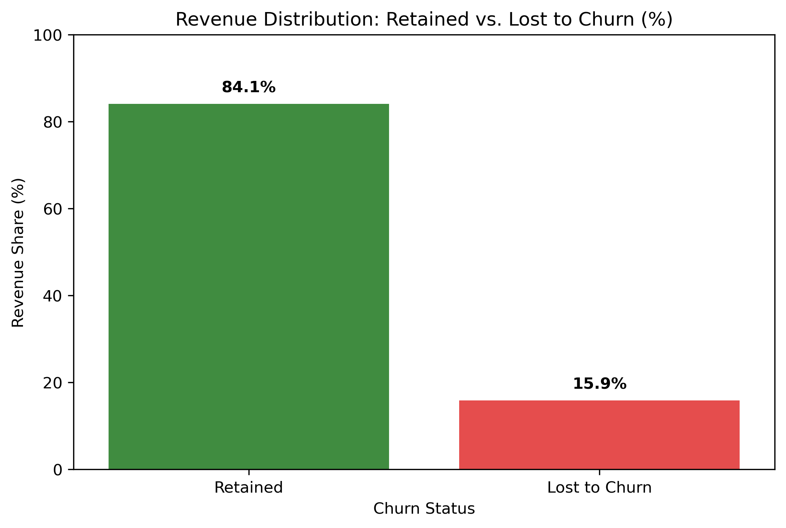
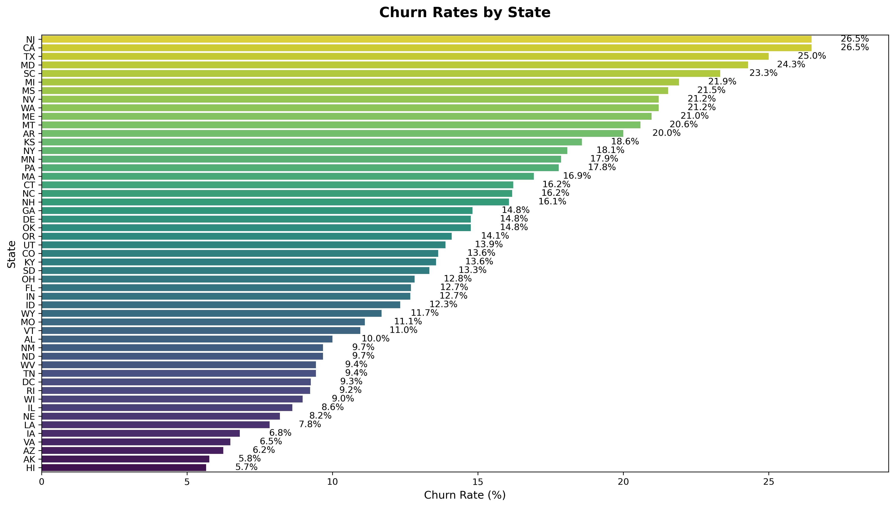
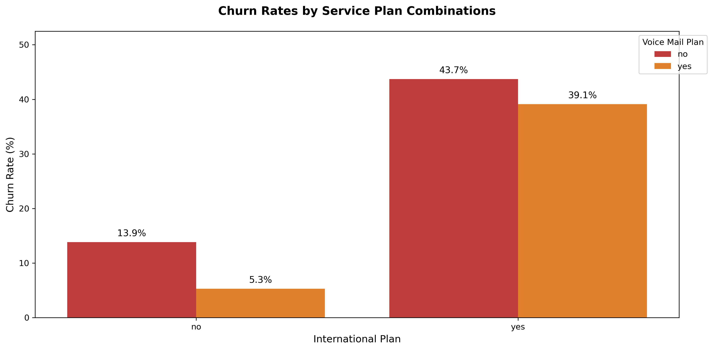
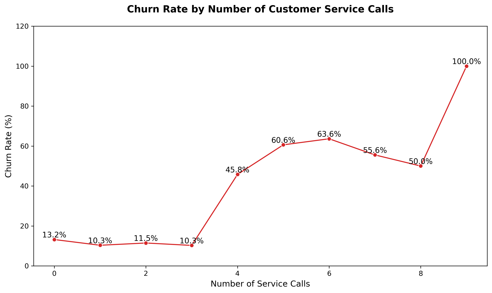
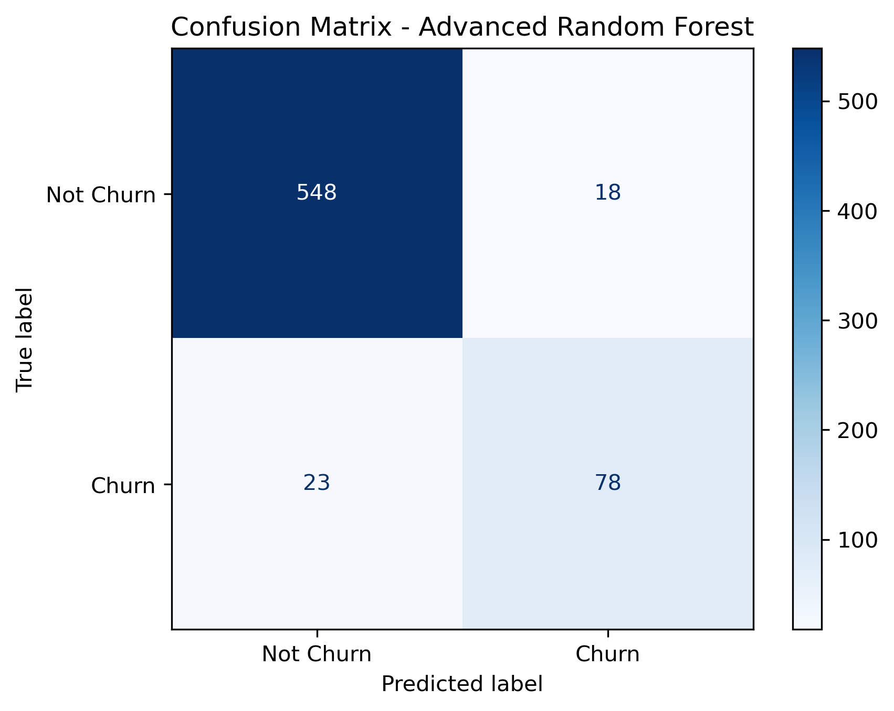
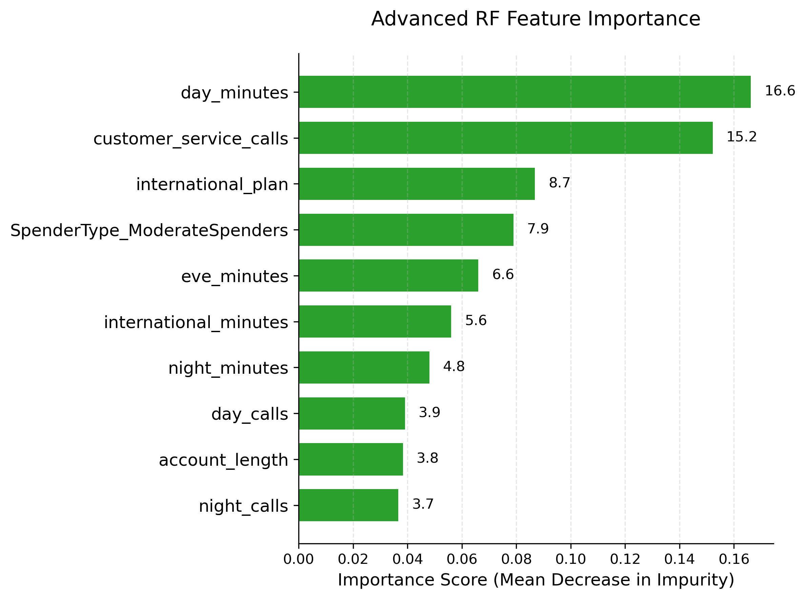

# 📊 SyriaTel Customer Churn Prediction

### Predicting Customer Attrition Using Machine Learning


---

## 📖 Project Overview

Customer churn is one of the leading causes of revenue loss in the telecommunications industry. Retaining existing customers is significantly more cost-effective than acquiring new ones, making churn prediction a critical business problem.

This project develops an end-to-end Machine Learning solution to identify customers at risk of leaving SyriaTel. By combining exploratory data analysis, feature engineering, and predictive modeling, the project enables proactive customer retention and data-driven decision-making.

---

## 🎯 Business Objectives

- Predict customers likely to churn.
- Identify the key drivers of customer attrition.
- Quantify the financial impact of churn.
- Recommend strategies to improve customer retention.

---

## 📂 Dataset

**Source:** Kaggle – SyriaTel Customer Churn Dataset

| Item | Description |
|------|-------------|
| Records | 3,333 Customers |
| Features | 21 |
| Target Variable | Churn |

---

## 🛠 Tech Stack

- Python
- Pandas
- NumPy
- Matplotlib
- Seaborn
- Scikit-learn
- SMOTE
- Jupyter Notebook

---

## 🔄 Project Workflow

```text
Business Understanding
        ↓
Data Preparation
        ↓
Exploratory Data Analysis
        ↓
Feature Engineering
        ↓
Model Development
        ↓
Model Evaluation
        ↓
Business Recommendations
```

---

# 📊 Exploratory Data Analysis

### Customer Churn Distribution

Only **14.5%** of customers churned, indicating an imbalanced dataset that required balancing during model development.


---

### Revenue Impact

Although churned customers represented only **14.5%** of the customer base, they accounted for approximately **15.9%** of total revenue.



---

### Geographic Analysis

Washington, New Jersey, and Texas recorded the highest churn counts, highlighting regions requiring targeted retention initiatives.



---

### Customer Spending

High-value customers experienced the highest churn rate, making them the most important customer segment for retention campaigns.


---

### Service Plans

Customers subscribed to the International Plan were significantly more likely to churn, while Voice Mail subscribers demonstrated higher retention.



---

### Customer Service Calls

Repeated interactions with customer support strongly correlated with churn. Customers making four or more service calls showed the highest likelihood of leaving.



---
## 🤖 Machine Learning Models

Five classification models were developed and evaluated to identify customers at risk of churn.

| Model | Accuracy | Precision | Recall | ROC AUC |
|-------|----------:|----------:|--------:|---------:|
| Logistic Regression | 88% | 73% | 33% | 86% |
| Regularized Logistic Regression | 81% | 42% | 80% | 86% |
| SMOTE Logistic Regression | 82% | 45% | 81% | 87% |
| Random Forest | 93% | 97% | 57% | 94% |
| **Advanced Random Forest** | **94%** | **81%** | **77%** | **93%** |

---

# 🏆 Best Performing Model

The **Advanced Random Forest Classifier** achieved the best balance between identifying customers likely to churn while minimizing false alarms.

### Performance Summary

- **Accuracy:** 94%
- **Precision:** 81%
- **Recall:** 77%
- **ROC AUC:** 93%

The model correctly identified **77% of customers who eventually churned**, enabling SyriaTel to intervene before they leave. At the same time, it maintained **81% precision**, ensuring that retention efforts are focused on genuinely high-risk customers rather than wasting resources on false alarms.

### Top Predictive Features

- Customer Service Calls
- International Plan
- Total Day Minutes
- Total Day Charge
- Account Length

### Model Evaluation





---

# 📌 Key Findings

- High-spending customers recorded the highest churn rates.
- Customer service interactions were the strongest predictor of churn.
- International Plan subscribers were significantly more likely to leave.
- Geographic location influenced churn behaviour.
- Predictive analytics enables proactive customer retention instead of reacting after customers have already left.

---

# 💡 Strategic Recommendations

- Prioritize retention efforts for high-value customers.
- Automatically flag customers with **three or more customer service calls** for immediate follow-up.
- Review the pricing and value proposition of the International Plan.
- Launch region-specific retention campaigns in high-churn states.
- Integrate the predictive model into SyriaTel's CRM system to provide real-time churn risk scores for customer relationship teams.

---

# 💼 Business Impact

This project demonstrates how Machine Learning can transform customer retention from a reactive process into a proactive business strategy.

By deploying the **Advanced Random Forest Classifier**, SyriaTel can:

- 🎯 Proactively identify approximately **77% of customers at risk of churning** before they leave.
- 💰 Protect high-value customers who contribute the largest share of lost revenue.
- 📉 Reduce customer attrition through targeted, data-driven retention campaigns.
- 📞 Detect dissatisfied customers early using customer service interaction patterns.
- 🌍 Focus marketing and retention resources on the highest-risk customer segments and geographic regions.
- 📊 Improve decision-making through predictive analytics rather than intuition.
- 🚀 Increase marketing efficiency by targeting customers with the highest likelihood of churn instead of broad campaigns.

---

## 🚀 Future Improvements

- Deploy the model as an interactive Streamlit application.
- Develop a FastAPI service for real-time churn prediction.
- Implement SHAP Explainability to improve model transparency.
- Build an automated MLOps pipeline for continuous model retraining.
- Deploy the solution to AWS or Microsoft Azure for production use.

---

⭐ **If you found this project useful, consider giving it a Star!**


